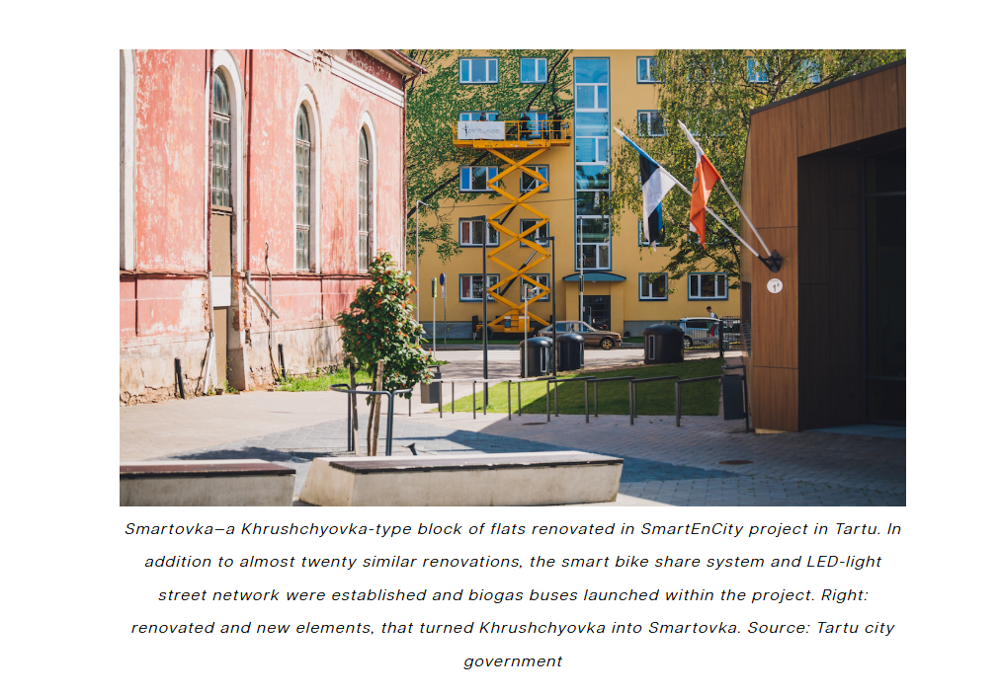
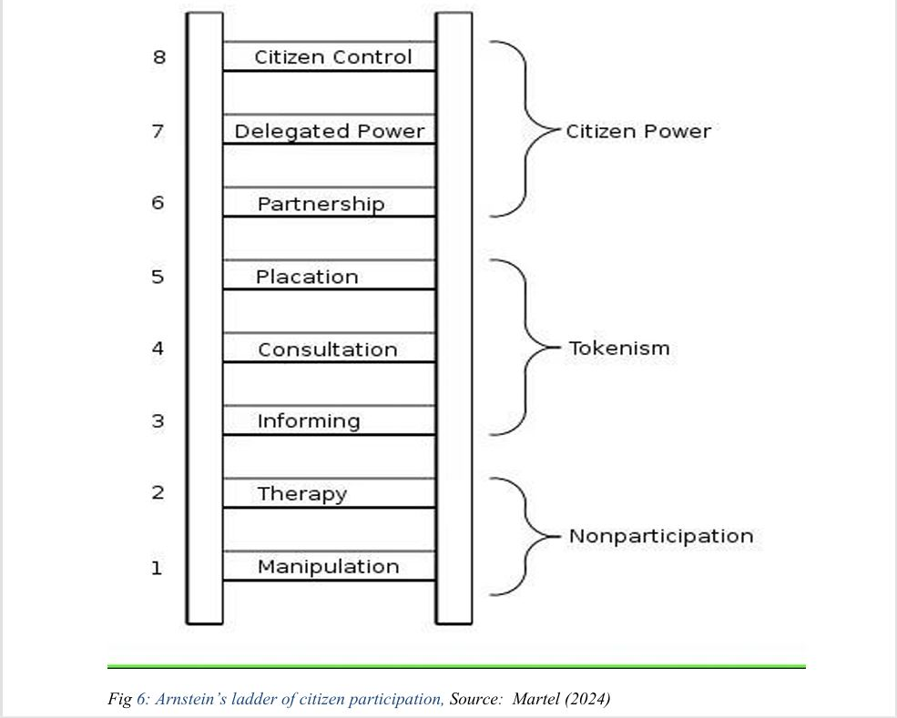
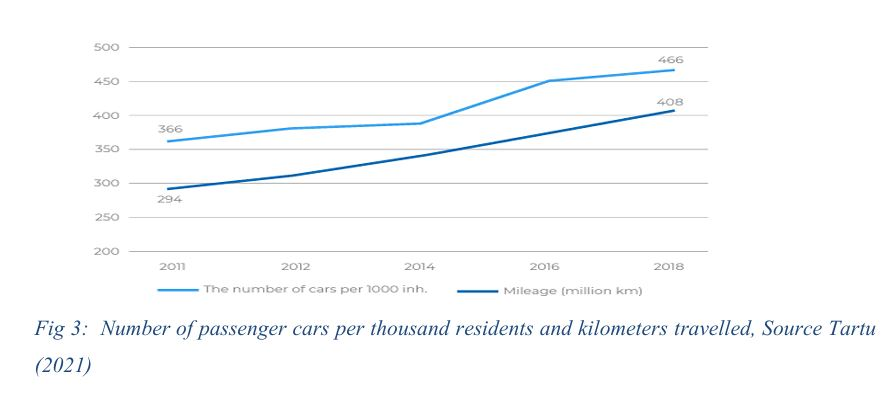

# Smart Sustainable Futures: A Participatory Design Analysis of Tartu, Estonia

**Project Type:** Collaborative Research Case Study  
**Institution:** Gdańsk University of Technology  
**Course:** Exploring Citizen Engagement for Smart Sustainable Cities  
**Research Team:**
- Timothy Mayowa Akintayo (Lead Researcher & Primary Author)
- Sanni Habeebulahi Gbolahan (Co-researcher)
- Desire Kabuya (Co-researcher)

## Collaborative Research Context
**My Role & Contribution:**
While assigned as a collaborative project, I served as sole researcher and author for this study. My co-researchers contributed during initial planning discussions including case study selection debates but were unable to participate in research execution due to concurrent PhD application deadlines.
I selected Tartu, Estonia as our case study based on its reputation for digital governance innovation and citizen engagement platforms, which aligned directly with my interest in participatory design from my Voice to the Street work.
**I independently completed:**
- All literature review and data analysis
- Framework application (Arnstein's Ladder assessment)
- Participatory budgeting evaluation (Section 4.4)
- Mobility systems analysis (Section 4.5)
- Digital exclusion critique and recommendations (Section 4.6)
- Complete report writing (28 pages)
Co-authors are credited for their contributions to initial research design discussions. The critical insights particularly the 25% digital exclusion finding and hybrid consultation model emerged from my independent analysis conducted under Professor Ciesielska's supervision.

---
## The Human Problem

Tartu, Estonia, is often cited as a European model for the "Smart City" concept. The city has successfully retrofitted Soviet-era housing into energy-efficient "Smartovkas" and deployed data-driven public transport.
---
**However, technology does not equal inclusion.**

This research investigates a critical gap in Tartu's strategy: **The Digital Divide.** While the city’s digital infrastructure is world-class, this analysis reveals that the reliance on digital-only platforms for citizen engagement systematically excludes vulnerable populations, particularly the elderly.

---
## Research Objectives
1.  **Evaluate** the *SmartEnCity* initiative beyond technical metrics (energy savings) to assess social impact (well-being).
2.  **Analyze** the effectiveness of Tartu's "Participatory Budgeting" (VOLIS) through the lens of social equity.
3.  **Propose** hybrid frameworks to bridge the gap between digital governance and low-literacy residents.

---
##  Methodology & Frameworks
We moved beyond standard policy review by applying rigorous sociological frameworks to urban data:

* **Arnstein’s Ladder of Citizen Participation:** Used to audit the true level of power citizens hold in Tartu.

    * *Result:* Tartu operates at **Rung 6 (Partnership)** for digital natives, but **Rung 3 (Informing)** for the elderly.
* **Data-Driven Mobility Analysis:** Reviewed anonymized mobile positioning data used by the municipality to redesign the bus network from circular to pendular lines.

## Key Findings

### 1. The Paradox of Participatory Budgeting
Tartu allows citizens to vote on 1% of the city budget via the VOLIS online platform.
* **The Success:** High engagement from university students and tech-savvy professionals.
* **The Failure:** **25% exclusion rate** among elderly residents who lack digital literacy. The "smart" tool became a barrier to democratic participation.

### 2. Mobility: Data vs. Behavior
Despite introducing bike-sharing and data-optimized bus routes to reduce carbon emissions:
* **Data Reality:** Private car usage actually *increased* during the study period.

* **Insight:** Infrastructure alone cannot change behavior without addressing cultural attachments to car ownership and perceived safety for cyclists.
### 3. The "Smartovka" Retrofit
Retrofitting *Khrushchyovkas* (Soviet panel buildings) reduced energy costs by nearly 60%, but residents reported feeling a loss of control due to automated heating systems they could not manually adjust.

## 📊 Visualizations
---
### Arnstein's Ladder Assessment
*Mapping Tartu's engagement strategies against the hierarchy of citizen power.*

**(See report Page 16 for detailed analysis)**
---
### Data-Driven Bus Network Redesign
**Transition from inefficient circular routes to linear pendular lines based on mobile positioning data.**

**(See report Page 22)**

---
## 💡 Recommendations (The "Phygital" Approach)
To solve the exclusion problem without abandoning technology, we proposed a **Hybrid Consultation Model**:
1.  To further improve Tartu’s sustainability goal and transition towards becoming a smart sustainable city, the city should offer targeted initiatives for older adults as it seems as if the participatory budgeting focuses more on the youths. Where as adults might as well have local needs that they wish to address but because they are not technologically savvy this might be a challenge making them marginalized. It is thus recommended that targeted initiatives asides the online platform perhaps a public office where projects can be submitted by the older groups to mitigate the digital divide and increase inclusivity. 
2.  Tartu should invest more in circular economy initiatives and recycling facilities to bring about reduction in landfill waste and promote more reuse. 
3.  Incorporate technology such as IoT to its waste disposals that will help the collection services to get real time information when wastes are full.
4. The city should improve its budgetary allocation for participative budgeting as the 1% of its budget for the participatory budgeting projects limits the implementation of a number of initiatives that can effectively benefit the city.

---
### 📂 Repository Structure
* `Tartu_Smart_City_Report.pdf` - The complete 28-page analysis.
* `figures/` - Extracted charts and maps from the study.
* `data_references/` - Links to the open datasets (Tartu Open Data) referenced in the study are in the references section of the study.
---
The full report of this research can be read here:  
[Tartu Smart City Report (PDF)](Tartu_Smart_City_Report.pdf)

*This research was conducted as part of the MSc curriculum at Gdańsk University of Technology. Co-researchers: Sanni Habeebulahi Gbolahan, Desire Kabuya.*
